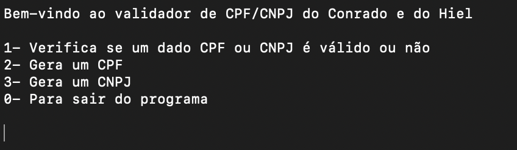

# CPF and CNPJ Generator & Checker

## Table of Contents

1. [General Objective](#general-objective)
2. [Project Overview](#project-overview)
   1. [Menu](#menu-pt-br)
3. [Features](#features)
4. [Team](#team)
5. [Compiling Files](#compile-multiple-files-into-the-same-package-in-vscode-macos)
6. [Interesting Observations](#interesting-observations)

---

## General Objective

- This project was developed as part of an Introduction to Programming in-person test. The goal was to create a menu-based application that can generate and validate CPF and CNPJ numbers, following the official Brazilian validation rules.

---

## Project Overview

- Menu with CPF and CNPJ generator and checker.

### Menu (PT-BR)



---

## Features

1. CPF and CNPJ generation: Automatically generate valid CPF and CNPJ numbers based on predefined rules.

2. CPF and CNPJ validation: Check if a given CPF or CNPJ number is correctly formatted and valid.

3. User-friendly menu system: Navigate easily through the options using a simple command-line interface.

---

## Team
- Hiel Saraiva
- Conrado Einstein.

---

## Compile multiple files into the same package in VSCode (macOS):

### First Option:
``````
gcc [file_name_1].c [file_name_2].c

./a.out
``````

### Second Option:
``````
clang -c [file_name_1].c

clang -c [file_name_2].c

clang [file_name_1].o [file_name_2].o

./a.out
``````

---

## Interesting observations:

### Create UNIX executable file:
``````
gcc -o [File Name].c
``````

### Create assembly code from C code:
``````
gcc -S [File Name].c
``````
